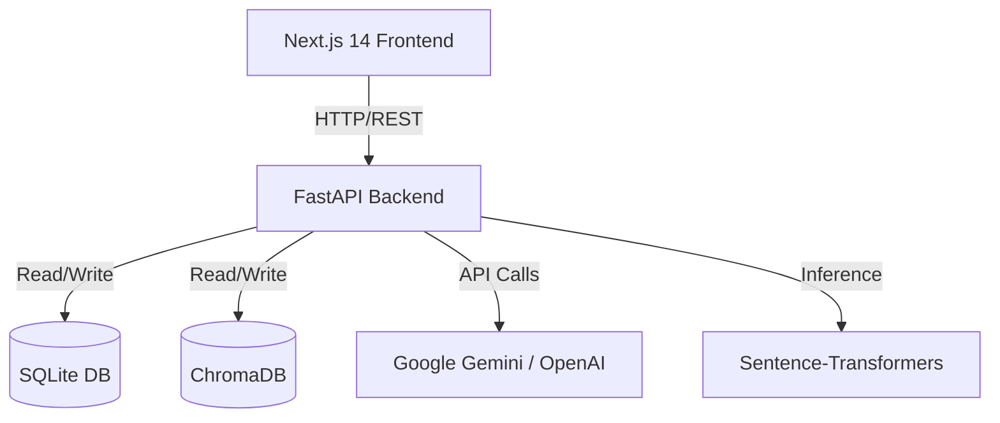

# CampusAI Architecture

## High-Level System Design

CampusAI is a modern, full-stack web application designed to act as an AI-powered college academic assistant.

## Backend Components

The backend is built with Python 3.9+ using FastAPI.

### 1. Data Layer
- **SQLite Database**: Managed by SQLAlchemy 2.0 (async implementation with `aiosqlite`). Stores metadata about documents, conversations, chat messages, study plans, and evaluation runs.
- **ChromaDB**: The vector database used to store embedded chunks of college documents for semantic search and Retrieval-Augmented Generation (RAG).

### 2. RAG Pipeline (`app/rag`)
- **Document Processor**: Uses LangChain loaders (`PyPDFLoader`, `Docx2txtLoader`, `TextLoader`) and `RecursiveCharacterTextSplitter` to process uploaded documents into manageable chunks.
- **Embeddings**: Uses `all-MiniLM-L6-v2` via `sentence-transformers` for local embedding generation. No external API calls are required to embed documents.
- **Retriever**: Performs similarity search over ChromaDB with a score threshold. Builds formatted context strings for the LLM.
- **LLM Provider**: Factory to instantiate Google Gemini or OpenAI based on `.env` configuration.

### 3. LangGraph Workflow (`app/graph`)
The core intelligence of the chat system is managed by a state machine built with LangGraph.

**Academic QA Flow:**
1. `analyze_query`: Classifies user intent (academic vs study planning vs general) and determines if retrieval is needed.
2. `retrieve_information`: Fetches context from ChromaDB if needed.
3. `generate_response`: Uses the designated LLM to produce an answer (or delegates to study planner).
4. `review_response`: A strict second pass where the LLM evaluates its own response for groundedness against the context to prevent hallucinations.
5. `finalize_response`: Formats the final output along with citations.

**Study Planner Flow:**
- Validates constraints (e.g., exam dates).
- Iteratively generates structured study plans (JSON) considering user availability and priorities.
- Modifies existing plans via natural language instructions.

## Frontend Components

The frontend is a single-page application built with Next.js 14 (App Router) and Tailwind CSS.

- **State Management**: Handled via custom React Hooks (`useChat`, `useDocuments`, `useStudyPlan`) that encapsulate API interactions.
- **Session Identity**: Uses a simple client-side UUID stored in `localStorage` to group conversations and study plans per user session (no complex authentication).
- **UI System**: Built with raw Tailwind CSS and Radix UI concepts. Includes interactive chat interfaces, drag-and-drop file uploaders, and visual study timelines.
- **Analytics & Evaluation**: Recharts is used to visualize RAG performance metrics and dashboard statistics.
